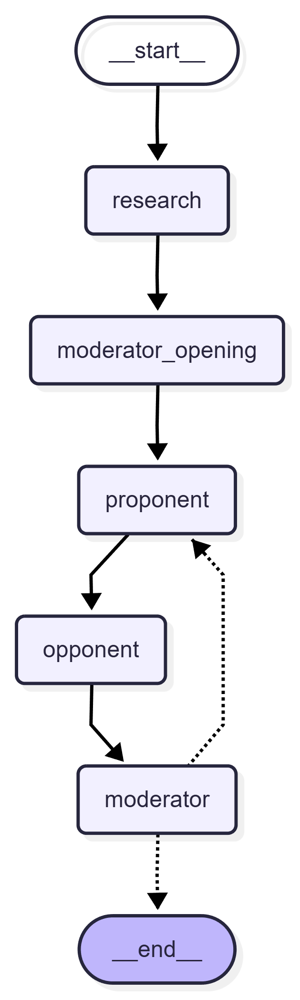

# LangGraph Multi-Agent Debate System

这是一个最小可运行的“深度研究与辩论系统”实现，核心由 LangGraph 驱动。

系统包含 4 个节点：

1. `research`：可选的外部资料检索节点。
2. `moderator_opening`：裁判开场，定义辩论目标和规则。
3. `proponent`：正方，持续提出支持论点并反击反方。
4. `opponent`：反方，持续挖漏洞、提风险、打击假设。
5. `moderator`：裁判，每轮做阶段总结，最后输出综合研究报告。

图结构如下：

`START -> research -> moderator_opening -> proponent -> opponent -> moderator -> (proponent | END)`

当 `current_turn >= max_turns` 时，图结束并输出最终报告。

## 安装

```bash
pip install -e .
```

## 环境变量

至少需要：

```bash
OPENAI_API_KEY=your_api_key
```

可选：

```bash
OPENAI_BASE_URL=https://your-openai-compatible-endpoint/v1
OPENAI_API_BASE=https://your-openai-compatible-endpoint/v1
OPENAI_API_URL=https://your-openai-compatible-endpoint/v1
OPENAI_MODEL=gpt-4.1
DEBATE_MODEL=gpt-4.1
OPENAI_MAX_RETRIES=5
OPENAI_TIMEOUT=60
```

CLI 会默认读取这些环境变量，所以通常不需要再传 `--api-key` 或 `--base-url`。

## 运行

```bash
deep-research-debate --topic "AI 是否会彻底取代初级程序员？" --turns 3 --search
deep-research-debate --topic "是否有必要将AI和人类安全意图对齐？" --turns 3 --search
deep-research-debate --topic '求职简历是否应该允许“美化”而不是如实陈述？' --turns 3 --search --search-full
deep-research-debate --topic '人类停止繁衍是否是对避免痛苦最彻底的道德选择' --turns 3 --search --search-full

```

或者：

```bash
python -m deep_research.cli --topic "核聚变商业化的真实前景" --turns 3 --search
```

## 参数

- `--topic`：辩论议题，必填
- `--turns`：最大辩论轮数，默认 `3`
- `--model`：模型名，默认读取 `DEBATE_MODEL` / `OPENAI_MODEL`，否则使用 `gpt-4.1`
- `--temperature`：默认 `0.4`
- `--search` / `--no-search`：是否启用检索，默认关闭
- `--search-results`：检索结果数量，默认 `5`
- `--base-url`：OpenAI 兼容接口地址
- `--api-key`：显式传入 API Key
- `--max-retries`：默认读取 `OPENAI_MAX_RETRIES`，默认值 `5`
- `--timeout`：默认读取 `OPENAI_TIMEOUT`，默认值 `60`

## 设计说明

- State 使用 TypedDict 定义，核心字段包括：
  - `topic`
  - `dialogue_history`
  - `current_turn`
  - `max_turns`
  - `search_context`
  - `final_report`
- `dialogue_history` 使用 LangGraph reducer 做追加式累积。
- 正反方和裁判全部基于同一个历史上下文推理。
- 检索节点是可选的，失败不会中断辩论，只会降级为无外部资料模式。

## 测试

```bash
python -m unittest discover -s tests -v
```

## 流程图


